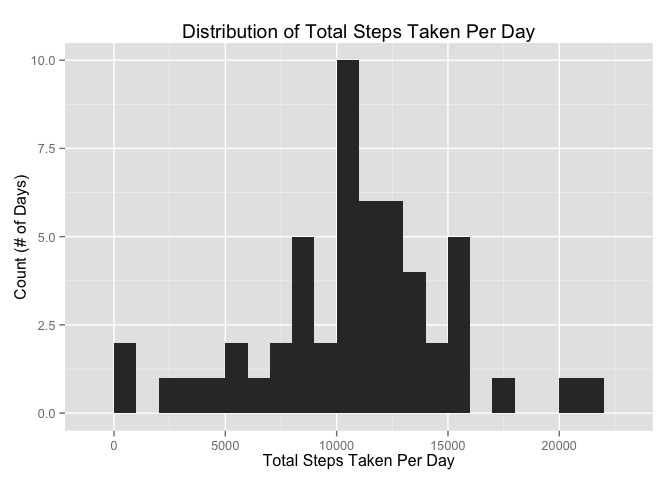
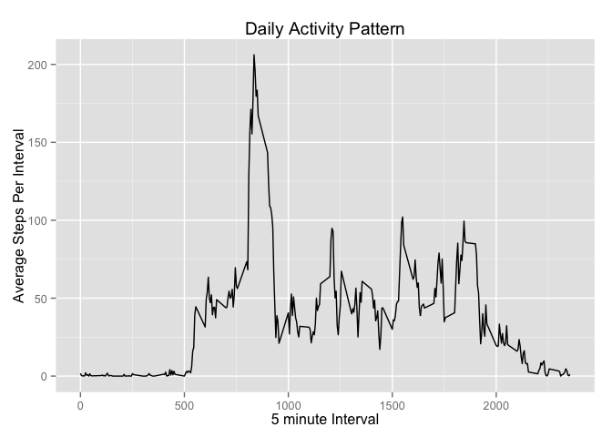
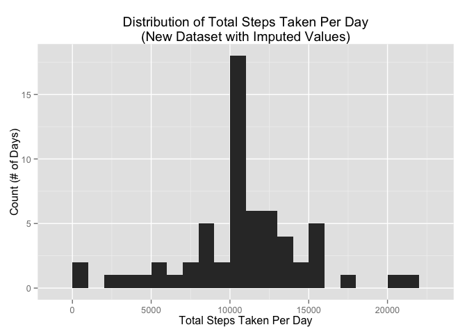
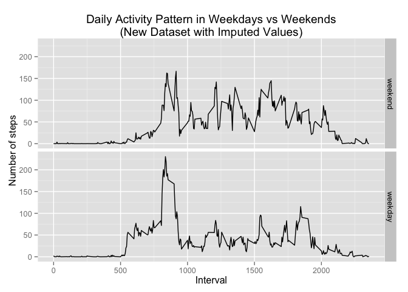

# Reproducible Research: Peer Assessment 1

```r
library(ggplot2)
library(knitr)
library(plyr)
```


## Loading and preprocessing the data

```r
zip_filename = "../repdata-data-activity.zip"
results = unzip(zip_filename, list=T)
filename = paste("../",as.character(results[1]),sep="")
# colClasses = c(factor, character, integer, numeric, logical, complex, and Date)
table1 = read.csv(filename, stringsAsFactors=T)

agg_date_stepSums = as.data.frame(aggregate(table1$steps, list(table1$date), sum))
names(agg_date_stepSums) = c("Date", "TotalStepsPerDay")

agg_interval_stepMeans = as.data.frame(aggregate(table1$steps, list(table1$interval), mean, na.rm=T))
names(agg_interval_stepMeans) = c("Interval", "AvgStepsPerInterval")

# find rows with no missing data
complete_rows = complete.cases(table1)
complete_data = table1[complete_rows,]
missing_data = table1[!complete_rows,]
```

## What is mean total number of steps taken per day?

The following code generates a histogram that shows the distribution of total steps per day.


```r
ggplot(data = agg_date_stepSums, aes(TotalStepsPerDay)) + 
    geom_histogram(binwidth = 1000) + 
    ggtitle("Distribution of Total Steps Taken Per Day") + 
    xlab("Total Steps Taken Per Day") + ylab("Count (# of Days)")
```

 


The mean and median total number of steps taken per day can be calculated using R's `summary` function.


```r
steps_summary = summary(agg_date_stepSums$TotalStepsPerDay)
steps_mean = steps_summary["Mean"]
steps_median = steps_summary["Median"]
```
  
  
The *mean* total number of steps taken per day is **10770** and the *median* number of steps taken per day is **10760**.  

  

## What is the average daily activity pattern?

A time series plot of the average daily activity pattern can be achieved by dividing the surveyed time into 5-minute intervals (x-axis) and averaging the number of steps taken in each 5-minute interval, averaged across all days (y-axis).


```r
ggplot(data = agg_interval_stepMeans, aes(Interval, AvgStepsPerInterval)) + 
    geom_line() + 
    ggtitle("Daily Activity Pattern") + 
    xlab("5 minute Interval") + ylab("Average Steps Per Interval")
```

 

Although one can visually estimate that the interval with the maximum average number of steps is approximately 800, the following code determines a more exact time of day:


```r
max_stepMeans_per_interval = agg_interval_stepMeans[agg_interval_stepMeans$AvgStepsPerInterval == max(agg_interval_stepMeans$AvgStepsPerInterval),]
```

Interval **835** contains the maximum number of steps (**206.1698113**) averaged across all of the days in the dataset.


## Imputing missing values

The missing values (coded as NA) from certain days/intervals may be introducing bias in the calculations. 

Out of the **17568 rows** in the provided dataset, **15264 rows** have *complete* information, and **2304 rows** have *missing* data.  

The mean number of steps for a given interval is used as an estimation for the missing values.  


```r
table_imputed = merge(table1, agg_interval_stepMeans, by.x="interval",by.y="Interval", all=T)
table_imputed[is.na(table_imputed$steps),"steps"] = table_imputed[is.na(table_imputed$steps),"AvgStepsPerInterval"]
```

Now, the histogram is re-created.


```r
agg_imp_date_stepSums = as.data.frame(aggregate(table_imputed$steps, list(table_imputed$date), sum))
names(agg_imp_date_stepSums) = c("Date", "TotalStepsPerDay")

ggplot(data = agg_imp_date_stepSums, aes(TotalStepsPerDay)) + 
    geom_histogram(binwidth = 1000) + 
    ggtitle("Distribution of Total Steps Taken Per Day\n(New Dataset with Imputed Values)") + 
    xlab("Total Steps Taken Per Day") + ylab("Count (# of Days)")
```

 

From the new dataset, the mean and median can be calculated.  


```r
new_steps_summary = summary(agg_imp_date_stepSums$TotalStepsPerDay)
new_steps_mean = new_steps_summary["Mean"]
new_steps_median = new_steps_summary["Median"]
```
  
  
The *mean* total number of steps taken per day is **10770** and the *median* number of steps taken per day is **10770**.  These values have not dramatically changed from the original dataset; in fact, the mean is the same, and the median increased by 10 total steps per day after the imputed values were considered.  This result is reassuring that the newly added data was similar to the original data and did not introduce large biases. 


## Are there differences in activity patterns between weekdays and weekends?


```r
table_imputed$date = as.Date(table_imputed$date)
table_imputed$DayOfWeek = weekdays(table_imputed$date)
table_imputed$isWeekend = "weekday"
table_imputed[table_imputed$DayOfWeek %in% c("Saturday","Sunday"),"isWeekend"] = "weekend"
table_imputed$isWeekend = factor(table_imputed$isWeekend, levels=c("weekend","weekday"))

weekly_agg_interval_stepMeans = aggregate(steps ~ interval + isWeekend, data=table_imputed, mean)
names(weekly_agg_interval_stepMeans) = c("Interval", "isWeekend", "AvgStepsPerInterval")

ggplot(data = weekly_agg_interval_stepMeans, aes(Interval, AvgStepsPerInterval)) + 
    geom_line() + facet_grid(isWeekend~.) +
    ggtitle("Daily Activity Pattern in Weekdays vs Weekends\n(New Dataset with Imputed Values)") + 
    xlab("Interval") + ylab("Number of steps")
```

 
